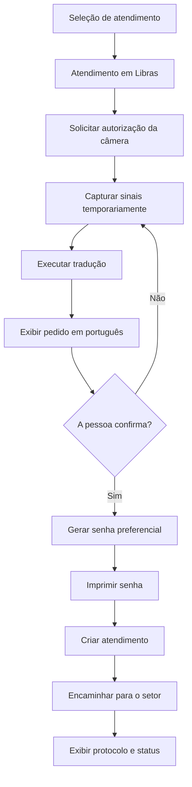

# Feature: Atendimento em Libras

## 1. Visão geral

Esta documentação descreve a nova opção **Atendimento em Libras**, que será adicionada às duas opções de atendimento já existentes no sistema.

A funcionalidade permitirá que a pessoa utilize a câmera do tablet para realizar seu pedido em Libras. O sistema deverá interpretar a solicitação, apresentar a tradução em português para confirmação e, somente após a confirmação, gerar a senha preferencial, imprimir o comprovante e encaminhar o atendimento para o setor responsável.

Esta documentação orienta a implementação inicial. O projeto já possui captura temporária da câmera, API intermediária configurável e fluxo de confirmação; o modelo de tradução continua sendo fornecido por um provedor especializado ou por um modelo local treinado.

## 2. Objetivo

Oferecer um fluxo de atendimento acessível para pessoas que utilizam Libras, mantendo as seguintes garantias:

- tradução revisável antes do envio;
- tratamento como atendimento preferencial, conforme regra de negócio definida;
- impressão da senha após a confirmação;
- funcionamento com internet e durante períodos de indisponibilidade;
- operação em vários tablets, distribuídos por setores diferentes;
- descarte imediato do vídeo utilizado na tradução.

## 3. Nome da opção

O rótulo da nova opção na seleção de atendimento será:

> **Atendimento em Libras**

Esse nome é mais preciso do que “pessoa muda”, pois nem toda pessoa surda é muda e nem toda pessoa que utiliza Libras possui a mesma forma de comunicação.

## 4. Fluxo principal



## 5. Telas e estados

### 5.1 Seleção de atendimento

O sistema já possui duas opções de atendimento. A nova opção será adicionada como a terceira:

- opção de atendimento existente 1;
- opção de atendimento existente 2;
- **Atendimento em Libras**.

Ao selecionar Atendimento em Libras, o sistema deverá explicar que a câmera será utilizada para interpretar o pedido.

### 5.2 Câmera e tradução

A tela deverá apresentar:

- pré-visualização da câmera;
- orientação para posicionamento da pessoa;
- indicação de que a tradução está em andamento;
- resultado parcial, quando disponível;
- opção para repetir o pedido;
- mensagem clara caso a câmera ou a tradução não estejam disponíveis.

O acesso à câmera deverá ocorrer somente depois da autorização da pessoa.

### 5.3 Confirmação da tradução

O sistema deverá apresentar o pedido traduzido em português e perguntar se está correto.

Opções mínimas:

- **Confirmar pedido**;
- **Fazer novamente**.

O atendimento não poderá ser encaminhado antes da confirmação explícita.

### 5.4 Senha e encaminhamento

Após a confirmação:

1. o pedido será classificado como Atendimento em Libras;
2. o atendimento receberá a classificação preferencial;
3. será gerado o número da senha;
4. a senha será impressa;
5. o atendimento será criado ou colocado na fila local;
6. o pedido será encaminhado para o setor correspondente;
7. o tablet exibirá o protocolo e o status.

## 6. Impressão da senha

A senha só deverá ser impressa depois que a pessoa confirmar a tradução.

Exemplo de impressão:

```text
ATENDIMENTO PREFERENCIAL

Senha: P-042
Canal: Libras
Setor: Atendimento
Protocolo: LIB-20260817-042
```

O formato final da senha deverá respeitar o padrão já utilizado pelo sistema.

### 6.1 Numeração com múltiplos tablets

Como existirão outros tablets em setores diferentes, cada atendimento deverá registrar:

- identificador do tablet;
- identificador do setor;
- número local da senha;
- identificador único da sessão;
- protocolo do atendimento;
- status de sincronização.

A estratégia de numeração dependerá do funcionamento das filas:

#### Filas independentes por setor

Cada setor poderá possuir uma sequência própria de senhas preferenciais.

#### Fila compartilhada entre setores

O servidor deverá reservar blocos de números para cada tablet enquanto houver conexão. Por exemplo:

- tablet do setor A: `P-001` até `P-050`;
- tablet do setor B: `P-051` até `P-100`.

Essa reserva evita duplicidade quando mais de um tablet estiver offline.

## 7. Funcionamento online e offline

O sistema deverá ser **offline-first** para esta funcionalidade.

### 7.1 Quando houver internet

- o tablet executará a tradução local;
- o atendimento será sincronizado com o servidor;
- a senha poderá ser obtida da sequência central;
- os dados da fila serão atualizados;
- o modelo local poderá receber atualizações autorizadas;
- os atendimentos pendentes poderão ser sincronizados.

### 7.2 Quando não houver internet

- a câmera continuará funcionando;
- a tradução será executada pelo modelo instalado no tablet;
- a senha será gerada localmente ou a partir de um bloco previamente reservado;
- a senha será impressa normalmente;
- o atendimento será gravado em uma fila local persistente;
- o sistema exibirá que o atendimento está aguardando sincronização;
- os dados serão enviados ao servidor assim que a conexão retornar.

### 7.3 Sincronização

Cada atendimento deverá possuir uma chave idempotente, formada por dados como:

```text
tabletId + setorId + sessionId
```

O servidor deverá reconhecer essa chave para impedir que o mesmo atendimento seja criado mais de uma vez após uma reconexão.

A sincronização deverá ser capaz de tratar os seguintes estados:

- pendente localmente;
- enviado;
- confirmado pelo servidor;
- erro temporário;
- aguardando nova tentativa;
- conflito de numeração;
- sincronizado.

## 8. Arquitetura da tradução

Não será adotada uma dependência exclusiva de API online. A tradução deverá funcionar localmente no tablet e utilizar o servidor como apoio.

### 8.1 Componentes sugeridos

#### Modelo de mãos

Analisa formato, orientação, posição e movimento das mãos.

#### Modelo corporal

Analisa braços, postura e localização dos movimentos em relação ao corpo.

#### Modelo facial

Considera expressões faciais, boca, sobrancelhas e movimentos da cabeça.

#### Modelo temporal

Analisa a sequência dos sinais ao longo do tempo, evitando interpretar cada frame como um sinal isolado.

#### Modelo de intenção

Converte a sequência reconhecida em um pedido relacionado ao setor selecionado.

#### Camada de fusão

Combina as previsões dos modelos e retorna:

- tradução final;
- intenção identificada;
- nível de confiança;
- indicação de repetição necessária;
- versão do modelo utilizado.

Pesquisas de reconhecimento de línguas de sinais utilizam múltiplas fontes de informação, como mãos, corpo, rosto, movimento e vídeo, porque cada uma contribui com uma parte diferente do significado. [SignMusketeers](https://aclanthology.org/2025.findings-acl.1157/) e [CVPR — combinação de múltiplas modalidades](https://openaccess.thecvf.com/content/CVPR2021W/ChaLearn/html/Gruber_Mutual_Support_of_Data_Modalities_in_the_Task_of_Sign_CVPRW_2021_paper.html).

### 8.2 Estratégia recomendada

O sistema deverá utilizar uma combinação multimodal, preferencialmente em formato de cascata:

1. modelos leves analisam a câmera continuamente;
2. um modelo temporal interpreta a sequência;
3. a camada de fusão combina os resultados;
4. um modelo mais pesado só é acionado quando houver dúvida;
5. a tradução é apresentada para confirmação.

Executar todos os modelos pesados o tempo todo pode aumentar consumo de memória, processamento, temperatura e bateria do tablet. Por isso, a combinação deverá ser calibrada para o hardware real.

### 8.3 Tecnologias candidatas

- MediaPipe ou tecnologia equivalente para extração de pontos das mãos, corpo e rosto;
- modelo específico de Libras treinado para os pedidos do projeto;
- LiteRT/TensorFlow Lite ou runtime equivalente para execução local;
- servidor para sincronização, atualização de modelos e apoio online.

O MediaPipe pode auxiliar na extração de pontos das mãos, mas não é, sozinho, um tradutor de Libras. [MediaPipe Hand Landmarker](https://developers.google.com/edge/mediapipe/solutions/vision/hand_landmarker)

O LiteRT é uma alternativa para executar modelos de aprendizado de máquina diretamente no dispositivo. [LiteRT para Android](https://ai.google.dev/edge/litert/android/java)

## 9. Confiança e tratamento de incerteza

Combinar vários modelos não garante automaticamente uma tradução correta. O sistema deverá possuir uma política explícita para incerteza.

| Situação | Comportamento |
|---|---|
| Alta confiança | Exibir a tradução para confirmação |
| Confiança intermediária | Exibir a tradução e recomendar repetição |
| Baixa confiança | Solicitar que a pessoa faça o pedido novamente |
| Falhas repetidas | Oferecer atendimento assistido por texto, intérprete ou atendente |
| Conflito entre modelos | Não criar atendimento sem confirmação clara |

O atendente nunca deverá receber uma solicitação automaticamente apenas porque o modelo produziu uma tradução.

## 10. Privacidade e descarte do vídeo

O vídeo deverá ser processado temporariamente e descartado imediatamente após a tradução, confirmação ou cancelamento.

Fluxo esperado:

```text
Câmera
  ↓
Buffer temporário em memória
  ↓
Modelos de reconhecimento
  ↓
Texto traduzido
  ↓
Confirmação da pessoa
  ↓
Descarte do vídeo e dos frames
```

Não deverá haver armazenamento permanente de:

- vídeo;
- frames;
- imagens da pessoa;
- gravações temporárias;
- cópia do vídeo durante o modo offline.

Deverão ser armazenados somente os dados necessários ao atendimento:

- texto confirmado;
- senha;
- protocolo;
- setor;
- tablet;
- horário;
- status da sincronização;
- versão do modelo;
- nível de confiança, se necessário para auditoria técnica.

## 11. Estrutura conceitual dos módulos

```text
Atendimento em Libras
├── Seleção de atendimento
├── Consentimento da câmera
├── Sessão de captura
├── Reconhecimento multimodal
│   ├── Mãos
│   ├── Corpo
│   ├── Rosto
│   ├── Movimento
│   └── Sequência temporal
├── Fusão e confiança
├── Confirmação da tradução
├── Geração de senha preferencial
├── Impressão
├── Fila local offline
├── Sincronização
└── Encaminhamento por setor
```

## 12. Dados mínimos do atendimento

Estrutura conceitual:

```text
AtendimentoLibras
├── sessionId
├── tabletId
├── setorId
├── canal: LIBRAS
├── preferencial: true
├── textoTraduzido
├── confirmadoPelaPessoa: true
├── senha
├── protocolo
├── status
├── statusSincronizacao
├── modeloVersao
├── confiancaTraducao
├── criadoEm
└── sincronizadoEm
```

## 13. Tratamento de falhas

O sistema deverá tratar pelo menos os seguintes cenários:

- pessoa não autoriza a câmera;
- câmera indisponível;
- câmera perde conexão durante a captura;
- modelo local não está disponível;
- modelo retorna baixa confiança;
- impressora indisponível;
- falta de papel;
- internet indisponível;
- sincronização falha;
- senha local entra em conflito;
- atendimento é enviado mais de uma vez;
- pessoa abandona o fluxo antes da confirmação.

Quando a impressora falhar, o atendimento não deverá ser perdido. O sistema deverá exibir uma mensagem, manter o atendimento salvo e permitir a impressão novamente.

## 14. Escopo inicial recomendado

Para a primeira versão, recomenda-se começar com um vocabulário controlado pelos pedidos mais comuns de cada setor.

Exemplos de categorias:

- solicitar atendimento;
- pedir informação;
- atualizar cadastro;
- retirar documento;
- solicitar suporte;
- informar problema;
- indicar o setor desejado.

O reconhecimento de qualquer frase aberta em Libras deverá ser tratado como uma evolução posterior, pois exige maior volume de dados, validação linguística e testes com usuários reais.

## 15. Fases do projeto

### Fase 1 — Definição

- confirmar os setores envolvidos;
- listar os pedidos mais comuns por setor;
- definir o formato da senha preferencial;
- definir se as filas são independentes ou compartilhadas;
- identificar o modelo e o hardware dos tablets;
- definir a impressora utilizada.

### Fase 2 — Prova de conceito

- validar acesso à câmera;
- testar execução local de modelos;
- testar tradução de um vocabulário limitado;
- testar confirmação da tradução;
- testar impressão offline;
- testar armazenamento local temporário.

### Fase 3 — Modelo multimodal

- combinar mãos, corpo, rosto e movimento;
- avaliar diferentes modelos de fusão;
- medir precisão por setor;
- medir tempo de resposta e consumo do tablet;
- validar com usuários de Libras e intérpretes.

### Fase 4 — Integração

- integrar a fila de atendimentos;
- integrar a geração de senha;
- integrar a impressora;
- integrar a sincronização entre tablets;
- implementar prevenção de duplicidades;
- implementar atualização dos modelos.

### Fase 5 — Piloto

- disponibilizar em um setor controlado;
- acompanhar erros de tradução;
- acompanhar falhas offline;
- revisar os pedidos não reconhecidos;
- ajustar o vocabulário e os modelos.

## 16. Critérios de aceite

- Atendimento em Libras aparece como a terceira opção de atendimento.
- A câmera só é utilizada após autorização.
- A tradução acontece sem internet quando o modelo local estiver disponível.
- O vídeo não é armazenado.
- A pessoa visualiza a tradução antes do envio.
- A pessoa pode repetir o pedido.
- O atendimento só é criado após confirmação.
- A senha é classificada como preferencial.
- A senha é impressa após a confirmação.
- O atendimento é direcionado ao setor correto.
- O funcionamento offline não gera perda do atendimento.
- Tablets diferentes não geram senhas duplicadas.
- O atendimento pendente é sincronizado quando a internet retorna.
- Uma falha de impressão permite tentar novamente.
- Uma falha de tradução oferece uma alternativa de atendimento.

## 17. Decisões pendentes

Antes da implementação, ainda será necessário definir:

1. sistema operacional e modelo dos tablets;
2. especificações de câmera, memória e processamento;
3. modelo de impressora e forma de conexão;
4. se cada setor possui uma fila própria;
5. padrão atual de numeração das senhas;
6. catálogo inicial de pedidos por setor;
7. modelo ou equipe responsável pelo reconhecimento de Libras;
8. necessidade de atendimento assistido por intérprete;
9. política de atualização do modelo local;
10. política de retenção do texto confirmado e dos dados de atendimento.

## 18. Referências técnicas

- [VLibras Translator API](https://traducao2.vlibras.gov.br/docs) — API documentada para tradução de português para Libras.
- [ML Kit — idiomas disponíveis para tradução](https://developers.google.com/ml-kit/language/translation/translation-language-support) — tradução de textos entre idiomas suportados.
- [MediaPipe Hand Landmarker](https://developers.google.com/edge/mediapipe/solutions/vision/hand_landmarker) — extração de pontos das mãos em imagens e vídeo.
- [LiteRT para Android](https://ai.google.dev/edge/litert/android/java) — execução de modelos de aprendizado de máquina no dispositivo.
- [SignMusketeers](https://aclanthology.org/2025.findings-acl.1157/) — abordagem multimodal para reconhecimento e tradução de línguas de sinais.
- [Mutual Support of Data Modalities in Sign Language Recognition](https://openaccess.thecvf.com/content/CVPR2021W/ChaLearn/html/Gruber_Mutual_Support_of_Data_Modalities_in_the_Task_of_Sign_CVPRW_2021_paper.html) — fusão de vídeo, pose, mãos e movimento.
